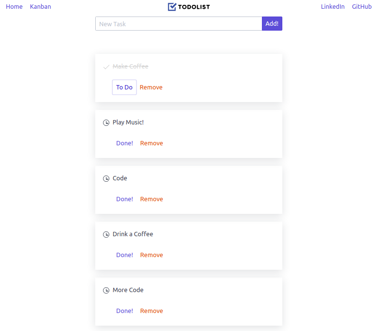
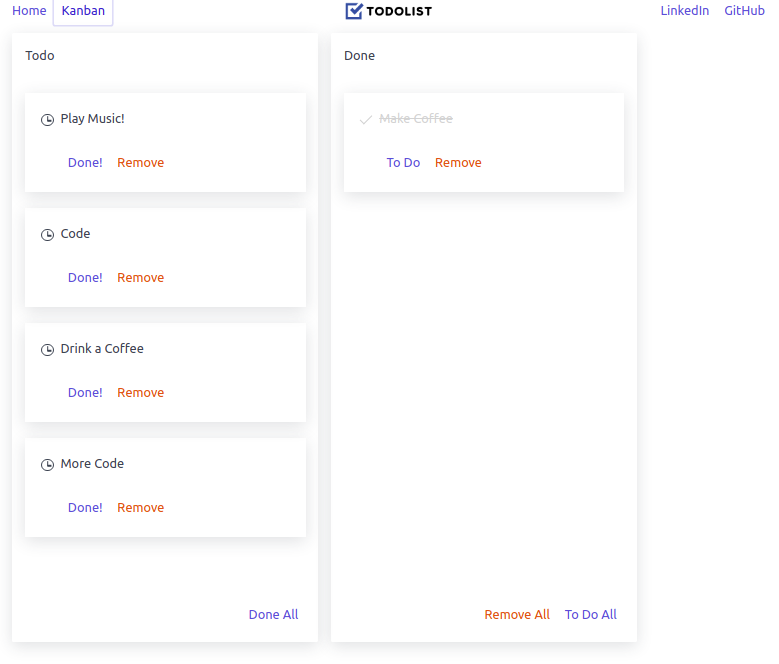

## TodoList with Vue.js

Simple ToDoList project using Vue, Vue CLI, Vue Routes and VueX

[Sample todoList Live](https://evertodo.netlify.app)

---



---



### Dependencies

* NPM - https://www.npmjs.com/get-npm
* Vue js - https://vuejs.org/
* Vue CLI - https://cli.vuejs.org/
* Vue Router - https://router.vuejs.org/

### Clone

* The repository can be cloned using the command:
```
git clone https://github.com/EverSilverio/todoListVue.git
```

## Author

Everton Silverio
[@EverSilverio](https://www.linkedin.com/in/eversilverio/)

See [Configuration Reference Vue CLI](https://cli.vuejs.org/config/).

## Bassed in lessons from SwitchCase Prof:[@paetzoldfelipe](https://twitter.com/paetzoldfelipe)

Thx SwitchCase for the lessons!

[YouTube Channel: SwitchCaseDev](https://www.youtube.com/c/SwitchCaseDev)

[](https://www.youtube.com/playlist?list=PLp7Agl_Dsq-xqtT7jn6PgzwC2jqdMajP2 "Curso intermediário de Vue: Vuex + Vue Router")
